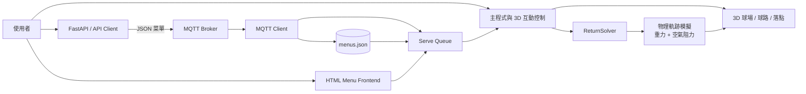

# 羽球發球機模擬系統

以 Python 建置的互動式 3D 羽球發球與回球模擬器。系統串接 FastAPI 與 MQTT 接收 JSON 訓練菜單，使用含重力及空氣阻力的物理模型計算球路，並透過 Ursina 呈現球場、發球、回球、落點與多視角觀察結果。

## Demo

Demo 影片網址：

<!-- 請將 Demo 影片網址貼在上方。 -->

## 專案動機

實體發球機的菜單測試需要到球場操作，不但耗費設備與場地資源，也不容易快速比較不同參數及回球策略。本專案建立一套與實體控制流程相近的模擬環境，讓使用者能在執行實機測試前先檢查發球軌跡、落點與回球結果。

## 主要功能

- 透過 FastAPI 或 MQTT 接收 JSON 訓練菜單。
- 使用速度、水平角度（yaw）、垂直角度（pitch）與發球間隔建立連續發球。
- 納入重力與空氣阻力，模擬羽球的三維飛行軌跡。
- 動態尋找接球點，計算 clear、drive、lift、drop、block、net soft、smash 等回球策略。
- 將菜單保存至 `menus.json`，支援排程、手動執行、刪除及每球回球策略覆寫。
- 提供瀏覽器管理介面，可切換視角、調整軌跡顯示及查看發球／回球紀錄。
- 以 Ursina 顯示室內球場、球網、羽球模型、飛行軌跡與落點標記。
- 提供唯讀驗證工具，檢查過網、回球可解性及球員移動時序。

## 系統架構

系統由通訊、前端管理與物理模擬三個子系統組成：



資料流程如下：

1. API 將 `shots` 轉換為模擬器使用的菜單格式，並發布至 MQTT。
2. 模擬器接收菜單、驗證每個 drill，保存原始 payload，並加入發球佇列。
3. 主程式依序執行發球；物理模組根據初速、角度、重力與阻力計算軌跡。
4. 啟用動態回球時，`ReturnSolver` 會選擇接觸點、檢查球員是否能及時移動，並求解指定落點的回球軌跡。
5. Ursina 將球路、球員移動及落點視覺化，HTML 介面同步提供菜單與顯示設定。

## 技術棧

| 類別 | 技術 |
| --- | --- |
| 程式語言 | Python 3.11+ |
| 3D 引擎 | Ursina |
| API | FastAPI、Uvicorn、Requests |
| 訊息傳遞 | MQTT、Eclipse Paho |
| 數值計算 | NumPy、SciPy |
| 套件管理 | uv |
| 資料儲存 | JSON |

## 專案結構

```text
.
├── main.py                       # Ursina 模擬器入口與執行流程
├── api_server.py                 # FastAPI 測試伺服器
├── api_client.py                 # API 呼叫範例
├── menus.json                    # 模擬器菜單與本地回球策略
├── scripts/
│   └── check_drills.py           # 菜單、球路與移動驗證工具
├── utils/
│   ├── BallFlight.py             # 發球動畫與軌跡顯示
│   ├── MQTTSimulator_menu.py     # MQTT 訂閱、控制與狀態回報
│   ├── config.py                 # 場地、物理、視覺與回球參數
│   ├── court.py                  # 3D 球場與室內場景
│   ├── html_menu_frontend.py     # 瀏覽器菜單管理介面
│   ├── menu_storage.py           # menus.json 存取與策略覆寫
│   ├── physics.py                # 發球模擬與回球軌跡求解
│   ├── return_solver.py          # 接球、球員移動與回球排程
│   ├── servemachine_api.py       # FastAPI 路由與 MQTT 發布
│   └── ui.py                     # 模擬器內提示資訊
└── assets/                       # 羽球模型與場地材質
```

## 安裝

### 需求

- Python 3.11 或更新版本
- [uv](https://docs.astral.sh/uv/)
- 可連線至 MQTT broker（預設為 `broker.emqx.io:1883`）

在專案根目錄同步依賴：

```bash
uv sync
```

## 執行方式

### 啟動 3D 模擬器

```bash
uv run python main.py
```

模擬器會同時：

- 啟動 Ursina 3D 視窗。
- 在背景連接 MQTT broker。
- 啟動 `http://127.0.0.1:8765/` 的菜單管理介面；按 `Esc` 可由模擬器開啟。

### 啟動 API 測試服務

另開終端機執行：

```bash
uv run python api_server.py
```

服務啟動後可使用：

- Swagger UI：`http://localhost:8000/docs`
- ReDoc：`http://localhost:8000/redoc`
- 健康檢查：`http://localhost:8000/health`

再開一個終端機發送範例菜單：

```bash
uv run python api_client.py
```

請先啟動模擬器，使其能接收 API 經 MQTT 發出的菜單。

## 操作方式

| 按鍵 | 功能 |
| --- | --- |
| `Esc` | 開啟 HTML 菜單管理介面 |
| `Q` | 離開模擬器 |
| `R` | 清除羽球、軌跡、落點與目前執行狀態 |
| `T` | 顯示／隱藏發球及回球軌跡 |
| `V` | 切換自由、發球機、球員及回球視角 |
| `N` | 切換自動／手動執行模式 |
| `Enter` | 在手動模式執行下一個排程菜單 |
| `B` | 在手動模式啟用／停用動態回球 |

自由視角沿用 Ursina `FirstPersonController` 的鍵盤與滑鼠操作。

## API

| 方法 | 路徑 | 用途 |
| --- | --- | --- |
| `GET` | `/machine/machine_status` | 取得模擬機狀態 |
| `POST` | `/machine/start_program` | 發送發球序列 |
| `POST` | `/machine/pause_program` | 暫停目前序列 |
| `POST` | `/machine/resume_program` | 繼續目前序列 |
| `POST` | `/machine/stop_program` | 停止目前序列 |

`POST /machine/start_program` 範例：

```json
{
  "call_id": "demo-alternating-backcourt",
  "shots": [
    {
      "speed": 50.0,
      "yaw": -7.0,
      "pitch": 30.0,
      "delay_ms": 1200,
      "description": "Backcourt left"
    },
    {
      "speed": 50.0,
      "yaw": 7.0,
      "pitch": 30.0,
      "delay_ms": 1200,
      "description": "Backcourt right"
    }
  ],
  "repeat": 1,
  "repeat_gap_ms": 0,
  "meta": {
    "menuName": "Alternating Backcourt"
  }
}
```

參數意義：

- `speed`：初速度（m/s）。
- `yaw`：水平偏轉角度（degree），控制左右方向。
- `pitch`：垂直發射角度（degree）。
- `delay_ms`：此球至下一球的間隔（ms）。
- `repeat`：序列執行次數；未提供或小於等於 0 時執行一次。
- `repeat_gap_ms`：重複輪次之間額外加入的間隔（ms）。

可在路徑加上 `machine_id` 查詢參數指定裝置，例如：

```text
POST /machine/start_program?machine_id=Badminton_simulator
```

## MQTT 主題

預設裝置名稱為 `Badminton_simulator`。

| 方向 | 主題 | 說明 |
| --- | --- | --- |
| API → 模擬器 | `/CALL/Badminton_simulator/IoT/menu` | 發送 JSON 菜單 |
| API → 模擬器 | `/CALL/Badminton_simulator/Feeder/control` | 發送 `pause`、`resume`、`stop` 控制 |
| 模擬器 → 外部 | `/CALL/Badminton_simulator/IoT/status` | 回報連線、執行進度及錯誤 |

本專案仍保留 `Badminton_simulator` 與 `broadcast` 舊主題的相容處理。

## 座標系統

菜單與全域座標使用：

- `x`：球場寬度（左右）。
- `y`：球場長度（前後）。
- `z`：高度。

Ursina 世界座標的對應為：

```text
world_x = global x
world_y = global z
world_z = global y
```

修改球路、回球或發球機位置時，請一併確認 `main.py` 的轉換函式與 `utils/config.py` 的場地常數。

## 驗證

檢查菜單中的發球是否能過網並落地：

```bash
uv run python scripts/check_drills.py --mode check-serves
```

完整檢查發球、回球求解與球員移動：

```bash
uv run python scripts/check_drills.py --mode check-all --strict
```

驗證工具只讀取 `menus.json`，不會改寫菜單內容。

## 團隊成員

- 賴邑城
- 江秉璋

詳細分工請參閱 [CONTRIBUTIONS.md](CONTRIBUTIONS.md)。
